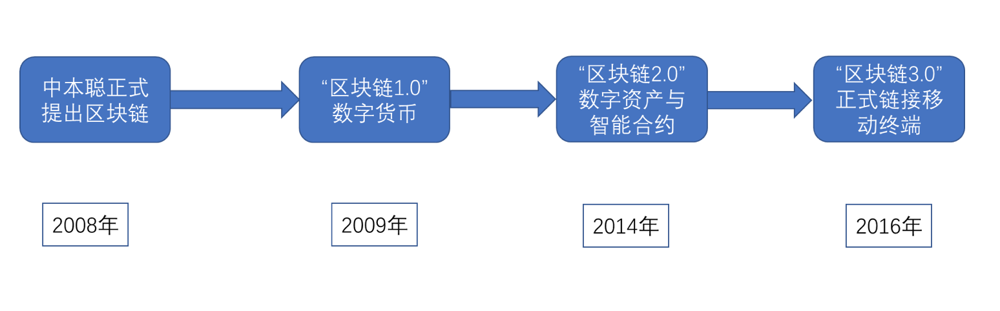
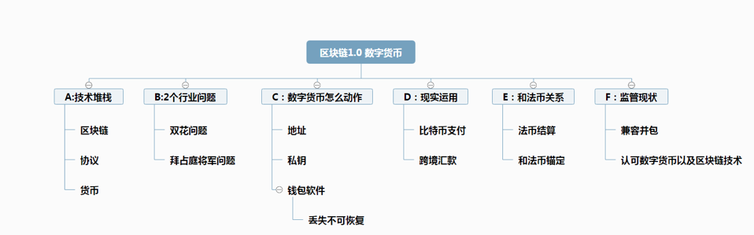
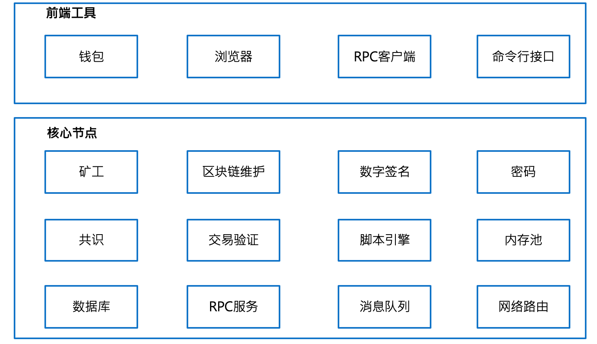
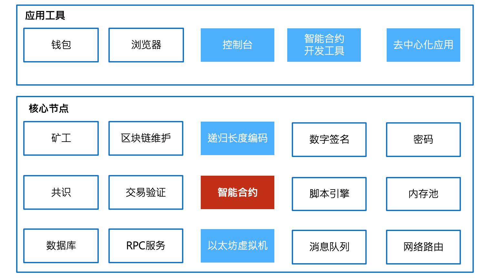
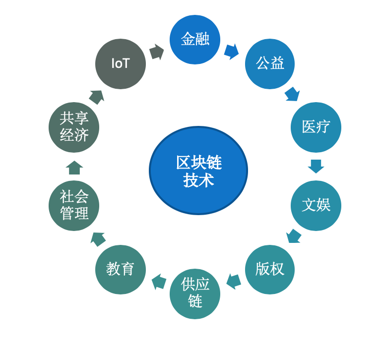
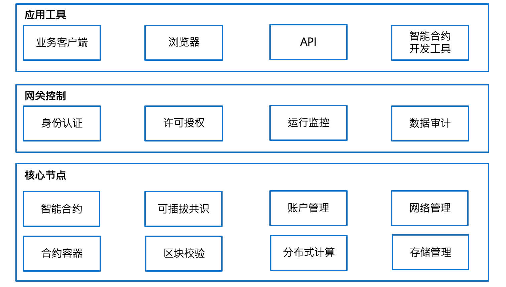

以太坊基础知识
==========
### 背景
区块链是什么？一句话，它是一种特殊的（非关系型）分布式数据库，这种数据库只能做插入和查找操作，并且没有管理员。

首先，区块链的主要作用是储存信息。任何需要保存的信息，都可以写入区块链，也可以从里面读取，所以它是数据库。

其次，任何人都可以架设服务器，加入区块链网络，成为一个节点。区块链的世界里面，没有中心节点，每个节点都是平等的，都保存着整个数据库。你可以向任何一个节点，写入/读取数据，因为所有节点最后都会同步，保证区块链一致。
### 区块链发展史

### 区块链1.0 时代
#### 前世：

**密码朋克（Cypherpunk）**

"密码朋克"是一套加密的电子邮件组，这个组里面的成员有：

维基解密创始人 阿桑奇

BT下载的作者 布莱姆-科恩

www万维网的发明者蒂姆伯纳斯-李

智能合约概念提出者：尼克萨博

Facebook创始人：肖恩帕克

#### 比特币之父：中本聪

在密码朋克组里面，讨论的话题有数学、加密技术、计算机技术、数字货币等等，尤其是关于数字货币的讨论，给了中本聪很多的灵感和技术的铺垫。

**2008年，中本聪发布比特币白皮书**

2008年，美国发生次贷危机，进而引发全球性的金融危机，各国法定货币大幅贬值，此时，一个自称中本聪的人或者组织在网络上发表了一篇<<比特币：一种点对点的电子现金系统>>论文。现在称区块链项目相关论文为白皮书。这篇白皮书描述了一个全新的数字货币系统-比特币。比特币解决了在完全没有中心机构的情况下，总量恒定的货币发行与流通问题。通过比特币系统进行转账， 公开透明。可以放心的将比特币转给地球另一端的人。每一笔的转账信息都会被全网记录，比特币白皮书的问世标志着比特币的底层技术-区块链的诞生。

**2009年，比特币创世区块诞生**

在区块链系统中，第一个区块称之为创世区块，比特币创世区块的诞生也标志着以区块链为底层技术的比特币系统真正的落地。

**2010年，10000个比特币买了一个披萨**

 这标志着比特币真正进入流通领域，行驶货币职能 。现在看来，这是世界上最贵的一披萨，现在比特币价格在3w人民币上下，10000个比特币价值3亿人民币。

在随后的几年中，比特币得到比较快速的发展，越来越多的组织机构开始接受比特币支付，并出现了很多类似比特币的竞争品，如莱特币、无限币、夸克币、泽塔币、元宝币、银通币...,这些都是在比特币代码上稍作修改而成，应用领域也是和比特币一样，主要在货币与支付领域。

以上称之为区块链1.0时代。

#### 区块链1.0 内容框架

区块链 1.0 主要是以数字货币

#### 区块链 1.0 架构
前端工具这，最明显就是钱包工具，提供用户管理自己账户地址和余额，浏览器用来查询当前区块链发生的数据情况，高度 区块数，交易数等

### 区块链2.0
区块链2.0是指智能合约,智能合约与货币相结合,对金融领域提供了更加广泛的应用场景.
区块链2.0的代表是'以太坊'.以太坊是一个平台,它提供了各种模块让用户用以搭建应用.平台之上的应用,其实也就是合约.这是以太坊技术的核心。

### 以太坊
以太坊，Ethereum是一个分布式的计算机，有许多的节点，其中的每一个节点，都会执行字节码（也就是所谓智能合约），然后把结果存在区块链上。由于整个网络是分布式的，且应用就是一个个的状态组成，存储了状态就有了服务；所以它就能永不停机，没有一个中心化的结点（没有任何一个节点说了算，去中心化的），任何第三方不能干预。

如果想做更深的了解，可以先读一下[以太坊白皮书](https://github.com/ethereum/wiki/wiki/White-Paper "以太坊白皮书")，或者看下这个视频，[25分钟理解以太坊](https://www.youtube.com/watch?v=66SaEDzlmP4 "25分钟理解以太坊")。（译者注：以太坊入门，确实没有什么好的办法，就是看白皮书最好，最快）
#### 区块链2.0 架构
与1.0相比，支持智能合约

### 区块链3.0
区块链3.0是指区块链在金融行业之外的各行业的应用场景.能够满足更加复杂的商业逻辑.区块链3.0被称为互联网技术之后的新一代技术创新,足以推动更大的产业改革.

#### 区块链3.0 架构
增加了网关控制，增加对安全保密的需求支持和数据审计加强对数据的可靠性管理

### 技术人员的机会

如何转型做区块链技术？

当前对区块链技术人员有两方面的需求：

- （1）区块链底层开发人员
- （2）智能合约开发人员
- （3）掌握区块链的技术原理

一般来讲，企业在做区块链应用时会选择一个现有的、比较成熟的区块链系统作为研究对象，在此基础上构建自己的区块链底层系统，或者是基于智能合约的去中心化应用，当前比较成熟稳定、被拿来做研究对象的区块链系统主要有两个：**超级账本和以太坊**
