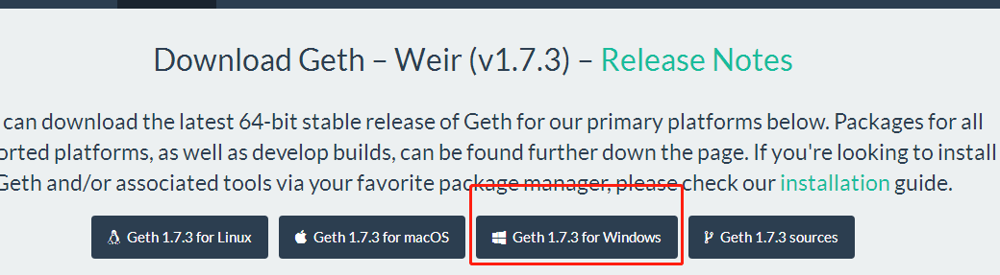
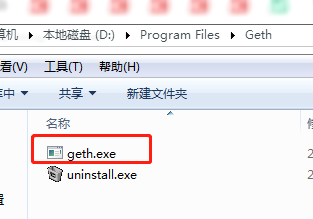
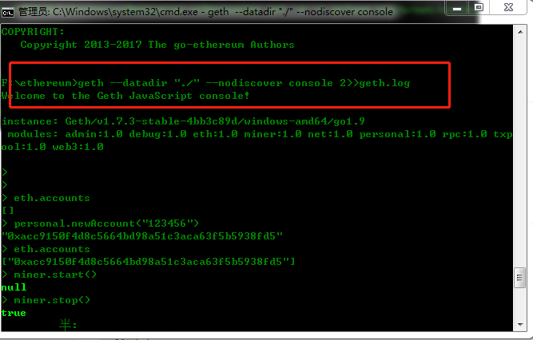

Windows搭建以太坊
==================
### 引言
Ethereum（以太坊）是一个使开发人员能够建立和发布下一代分布式应用的公共区块链平台。 通过其专用加密货币以太币（Ether）提供去中心化的虚拟机（称为“以太虚拟机”Ethereum Virtual Machine）来处理点对点合约。具体可以访问
[https://ethereum.org/](https://ethereum.org/)  来了解更多相关信息！

### 环境搭建
##### 下载可执行文件
访问 [ https://geth.ethereum.org/downloads/.](https://geth.ethereum.org/downloads/.)  出现如图所示

<div align=center>


</div>

点击基于Windows平台，可下载文件 **geth-windows-amd64-1.7.3-4bb3c89d.exe**

然后双击后会生成目录


<div align=center>


</div>
点击图中的geth.exe即可！

##### 配置语言环境
由于源码是基于go语言开发，需要配置go语言的环境，这里可以通过choco 进行安装，如果没有choco的环境可以通过 访问链接 **[ https://chocolatey.org ](https://chocolatey.org)**   进行安装choco. 然后重新打开一个dos窗口执行如下命令

> C:\Windows\system32> choco install git

> C:\Windows\system32> choco install mingw


安装完毕后，设置环境变量。
##### 下载go-ethereum
在F盘创建一个目录ethereum ，然后通过进入此目录执行

> git clone https://github.com/ethereum/go-ethereum

> cd go-ethereum

> go get -u -v golang.org/x/net/context

> go install -v ./cmd/...               #编译geth

至此环境已经安装完毕，但是需要测试是否可以用！

### 初步探索
准备创世区块配置文件
以太坊支持自定义创世区块，要运行私有链，我们就需要定义自己的创世区块，创世区块信息写在一个json格式的配置文件中。首先将下面的内容保存到一个json文件中，例如genesis.json。
```
{
  "config": {
        "chainId": 15,
        "homesteadBlock": 0,
        "eip155Block": 0,
        "eip158Block": 0
    },
    "coinbase" : "0x0000000000000000000000000000000000000000",
    "difficulty" : "0x40000",
    "extraData" : "",
    "gasLimit" : "0xffffffff",
    "nonce" : "0x0000000000000042",
    "mixhash" : "0x0000000000000000000000000000000000000000000000000000000000000000",
    "parentHash" : "0x0000000000000000000000000000000000000000000000000000000000000000",
    "timestamp" : "0x00",
    "alloc": { }
}
```

cmd进入上面创建的目录,然后执行指令

> geth --datadir data init genesis.json  

   上面的命令的主体是geth init，表示初始化区块链，命令可以带有选项和参数，其中--datadir选项后面跟一个目录名，这里为data，表示指定数据存放目录为data，genesis.json是init命令的参数。运行上面的命令，会读取genesis.json文件，根据其中的内容，将创世区块写入到区块链中。
```shell
E:\eth>geth -datadir data init genesis.json
INFO [01-20|10:27:57] Maximum peer count                       ETH=25 LES=0 total=25
INFO [01-20|10:27:57] Allocated cache and file handles         database=E:\\eth\\data\\geth\\chaindata cache=16 handles=16
INFO [01-20|10:27:57] Writing custom genesis block
INFO [01-20|10:27:57] Persisted trie from memory database      nodes=0 size=0.00B time=0s gcnodes=0 gcsize=0.00B gctime=0s livenodes=1 livesize=0.00B
INFO [01-20|10:27:57] Successfully wrote genesis state         database=chaindata                      hash=b240e0…e37e4e
INFO [01-20|10:27:57] Allocated cache and file handles         database=E:\\eth\\data\\geth\\lightchaindata cache=16 handles=16
INFO [01-20|10:27:57] Writing custom genesis block
INFO [01-20|10:27:57] Persisted trie from memory database      nodes=0 size=0.00B time=0s gcnodes=0 gcsize=0.00B gctime=0s livenodes=1 livesize=0.00B
INFO [01-20|10:27:57] Successfully wrote genesis state         database=lightchaindata                      hash=b240e0 …e37e4e

E:\eth>
```

**启动私有链节点**

> geth --datadir "./" --nodiscover console 2>>geth.log


<div align=center>


</div>

然后执行如下可以挖坑、交易等操作！

```
> eth.accounts
[]
> personal.newAccount("123456")
"0xacc9150f4d8c5664bd98a51c3aca63f5b5938fd5"
> eth.accounts
["0xacc9150f4d8c5664bd98a51c3aca63f5b5938fd5"]
> miner.start()
null
> miner.stop()
true
> eth.accounts
["0xacc9150f4d8c5664bd98a51c3aca63f5b5938fd5"]
> eth.blockNumber
0
> personal.newAccount("12345")
"0xa6b519c11b19fd73d08262a8e964ccda3509c015"
> user1=eth.accounts[0]
"0xacc9150f4d8c5664bd98a51c3aca63f5b5938fd5"
> user2=eth.accounts[1]
"0xa6b519c11b19fd73d08262a8e964ccda3509c015"
> eth.getBalance(user1)
0
> eth.getBalance(user2)
0
> miner.start()
null
> miner.stop()
true
> eth.coinbase
"0xacc9150f4d8c5664bd98a51c3aca63f5b5938fd5"
> miner.setEtherbase(user1)
true
> eth.coinbase
"0xacc9150f4d8c5664bd98a51c3aca63f5b5938fd5"
> eth.getBalance(user1)
```
