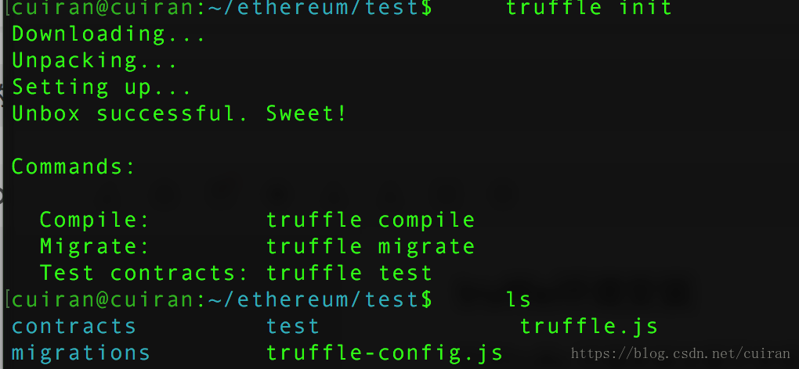
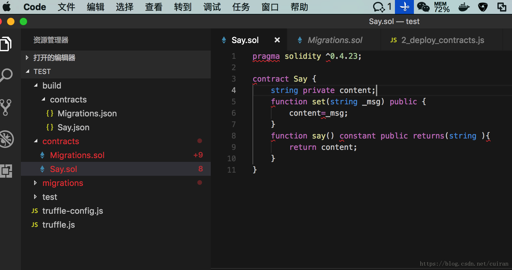
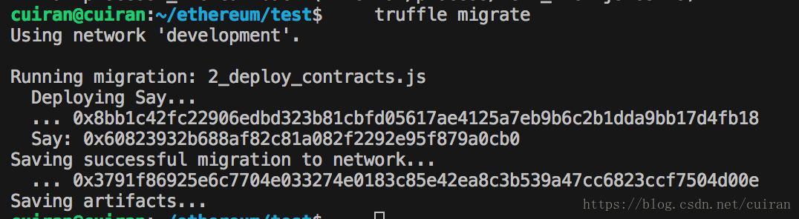

Truffle安装部署和测试
=====================
### truffle环境安装
针对truffle 环境安装可以参考此前介绍
`$ npm install -g truffle`

### 初始化
打开终端创建一个目录

```shell
mkdir test
cd test
truffle init
```

会生成文件

<div align=center>


</div>


### 新建合约文件

然后可以用vscode打开test目录
新建一个合约


<div align=center>


</div>


```
pragma solidity ^0.4.23;

contract Say {
    string private content;
    function set(string _msg) public {
        content=_msg;
    }
    function say() constant public returns(string ){
        return content;
    }
}
```
### 增加合约部署文件
在目录migrations新建2_deploy_contracts.js
```
var Say = artifacts.require("./Say.sol");
module.exports = function(deployer) {
  deployer.deploy(Say);
};
```
### 编译合约
执行命令

> truffle compile

### 部署合约到区块链上
修改目录下的文件truffle.js
如下(host和port要根据自己的配置来定)

```

module.exports = {
  // See <http://truffleframework.com/docs/advanced/configuration>
  // to customize your Truffle configuration!
  networks:{
    development:{
      host:"localhost",
      port:8545,
      network_id:"*",
      gas:3000000
    }
  }
};
```
在部署之前先解锁账号 ，并启动挖矿

> personal.unlockAccount(user1)

> miner.start()

然后执行truffle migrate 部署合约

<div align=center>


</div>


这样合约就部署成功了，但是怎么调用呢？下面会讲到


### 合约调用
配置参数参数位于truffle中的build/contracts目录下的Say.json文件中
可以打开文件查找到
配置abi参数

```
 var abi=[
            {
                "constant": false,
                "inputs": [
                    {
                        "name": "_msg",
                        "type": "string"
                    }
                ],
                "name": "set",
                "outputs": [],
                "payable": false,
                "stateMutability": "nonpayable",
                "type": "function"
            },
            {
                "constant": true,
                "inputs": [],
                "name": "say",
                "outputs": [
                    {
                        "name": "",
                        "type": "string"
                    }
                ],
                "payable": false,
                "stateMutability": "view",
                "type": "function"
            }
        ]
```
配置addr参数

```
        var addr="0x60823932b688af82c81a082f2292e95f879a0cb0"
```
然后进行调用即可

```
var adoption = web3.eth.contract(abi).at(addr)
console.log("获取account[0]"+web3.eth.accounts[0]);
adoption.set.sendTransaction("I'm here!!!", {from:web3.eth.accounts[0]})
var str= adoption.say();
console.log("获取成功"+str);
```

打印的日志：

```
获取成功I'm here!!!
```
到此调用智能合约就ok了！！！
