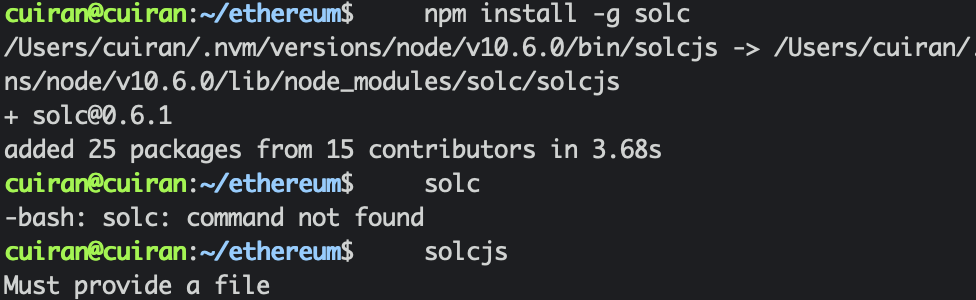
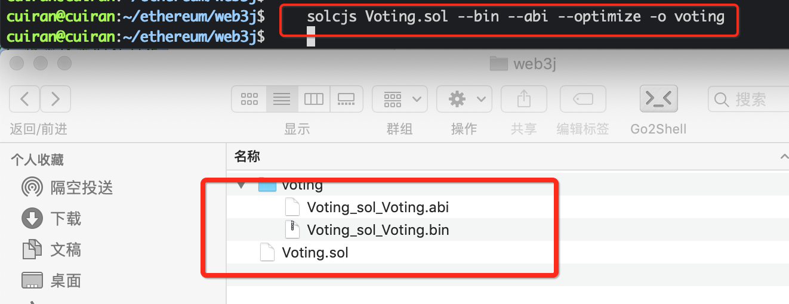
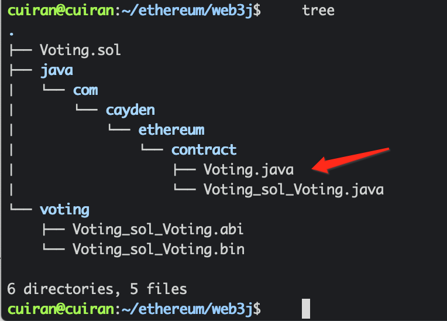

投票项目实战
======================

### 投票智能合约编写
```go
pragma solidity >=0.4.22 <0.6.2;

contract Voting {

    mapping (bytes32=>uint8) public votesReceived;

    //存储候选人名字的数组
    bytes32 [] public candidateList;

    //构造函数 初始化候选人名单
    constructor (bytes32[] memory candidateNames) public{
        candidateList=candidateNames;
    }
    //查询某个候选人的总票数
    function totalVotesFor(bytes32 candidate) public view returns(uint8){

        require(validCandidate(candidate) == true);

        return votesReceived[candidate];
    }
    //为某个候选人投票
    function voteForCandidate(bytes32 candidate) public{
        assert(validCandidate(candidate)==true);
        votesReceived[candidate]+=1;

    }

    // 检索投票的姓名是不是候选人的名字
    function validCandidate(bytes32 candidate) public view returns (bool) {
        for(uint i = 0; i < candidateList.length; i++) {
            if (candidateList[i] == candidate) {
                return true;
            }
        }
        return false;
    }
}

```
### solc命令的使用
1、首先使用该命令需要安装solidity编译工具solc

```shell
npm install -g solc
```

<div align=center>


</div>


2、solc编译命令：

```shell
solcjs <Solidity文件地址>.sol --bin --abi --optimize -o <输出文件夹路径>/
```
编译如图所示：
<div align=center>


</div>


### web3j的命令行工具打包

1、首先安装web3j 命令工具

```shell
curl -L https://get.web3j.io | sh
```

2、如何使用，查看帮助
```shell
Usage: solidity generate [-hV] [-jt] [-pt] [-st] -a=<abiFile>
                         [-al=<addressLength>] [-b=<binFile>]
                         [-c=<contractName>] -o=<destinationFileDir>
                         -p=<packageName>
  -a, --abiFile=<abiFile>    abi file with contract definition.
  -b, --binFile=<binFile>    bin file with contract compiled code in order to
                               generate deploy methods.
  -c, --contractName=<contractName>
                             contract name (defaults to ABI file name).
  -o, --outputDir=<destinationFileDir>
                             destination base directory.
  -p, --package=<packageName>
                             base package name.
      -al, --addressLength=<addressLength>
                             address length in bytes (defaults to 20).
      -jt, --javaTypes       use native Java types.
                               Default: true
      -st, --solidityTypes   use solidity types.
      -pt, --primitiveTypes  use Java primitive types.
  -h, --help                 Show this help message and exit.
  -V, --version              Print version information and exit.
```
3、开始打包代码

```shell
 web3j solidity generate -b voting/Voting_sol_Voting.bin -a voting/Voting_sol_Voting.abi -c Voting -o java -p com.cayden.ethereum.contract
```
生成对应的java类

<div align=center>


</div>


### 异常汇总
1.  java.lang.RuntimeException: java.lang.RuntimeException: Error processing transaction request: insufficient funds for gas * price + value
这个是以太坊手续费不足异常（insufficient funds）
